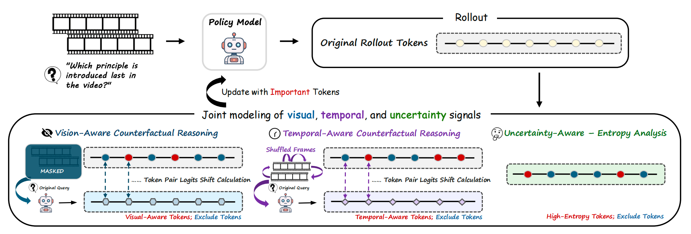
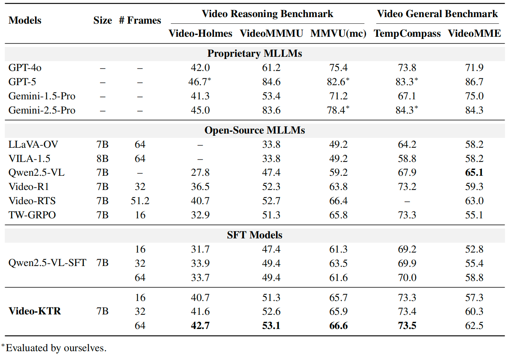
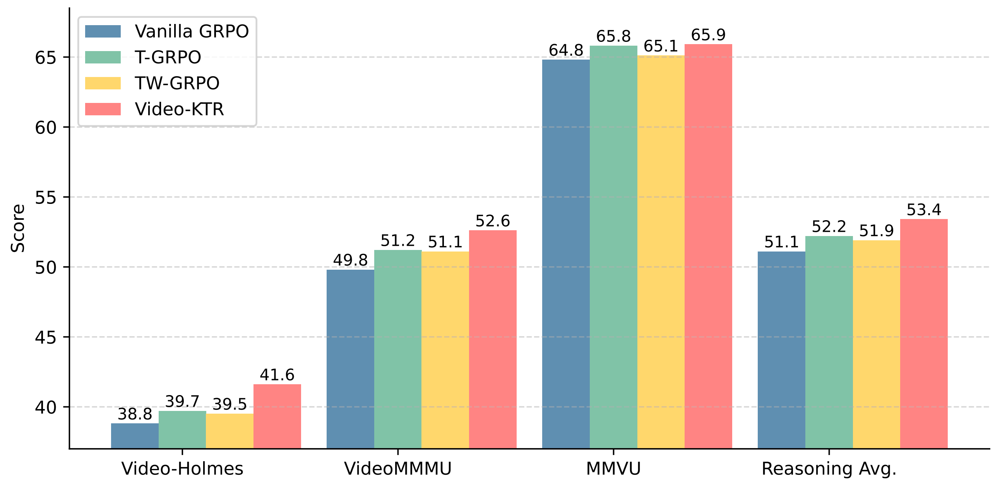
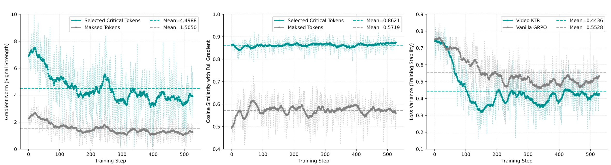
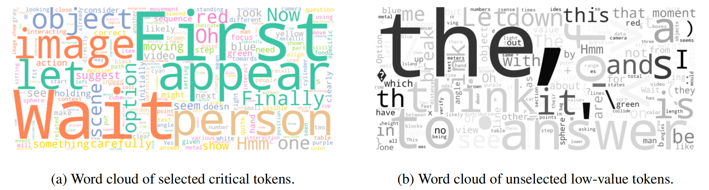
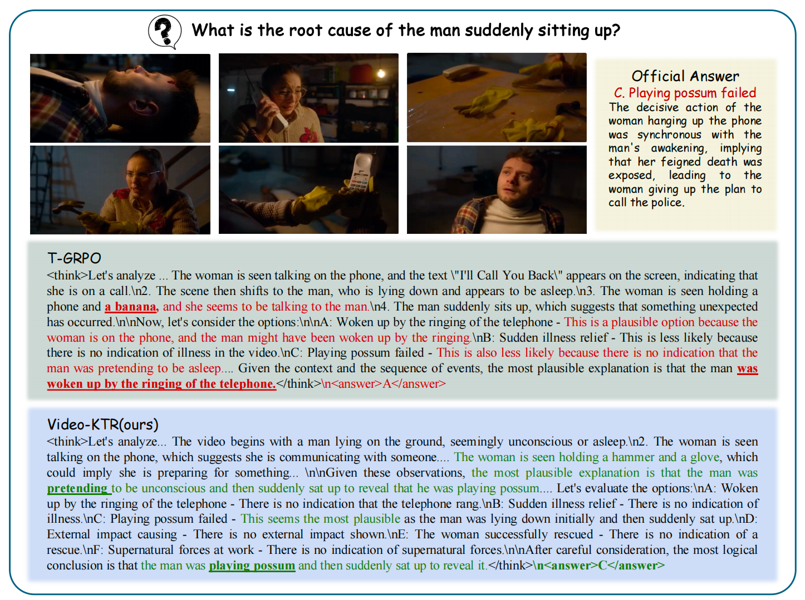
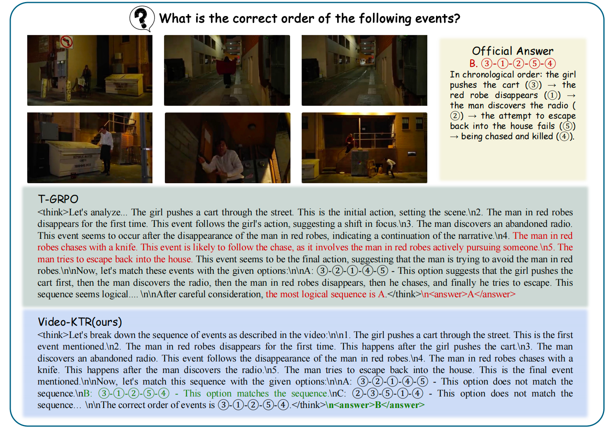

# 🦈 Video-KTR: Key-Token Reinforcement for Video Reasoning

> **Video-KTR** is a reinforcement learning framework designed for complex video reasoning.\
> It identifies and amplifies *critical visual--temporal tokens* via selective gradient reinforcement, significantly improving video reasoning performance.

[📖 Paper(WIP)]
[[🤗 Video-KTR-7B-model](https://huggingface.co/Video-KTR/Video-KTR-7B)]

## 🌟 Highlights

-   🚀 **State-of-the-art performance** on multiple video reasoning benchmarks (Video-Holmes, VideoMMMU, MMVU, VideoMME)
-   🎯 **Key Token Reinforcement (KTR)**: amplifies signal on high-entropy / visual-aware / temporal-aware tokens
-   🔍 **Better temporal and causal reasoning** demonstrated by detailed case studies
-   🧩 Compatible with **Video-R1**, **Qwen2.5-VL**, and **Video-R1-SFT** pipelines

<div align="center">
  
</div>

Video-KTR improves video reasoning by identifying truly critical reasoning tokens. We use counterfactual probing (masking images or shuffling frames) to find
- 👀 visual-aware tokens
- ⏰ temporal-aware tokens
- and apply entropy filtering to select uncertain but informative tokens.

During training, non-critical tokens are masked, and gradients are reinforced only on key tokens, enabling more stable and accurate temporal–causal reasoning.

------------------------------------------------------------------------

### 📊 Main Results

- On **Video-Holmes**, Video-KTR reaches **42.7**, **nearly matching closed-source models** such as GPT-4o (**42.0**) and Gemini-2.5-Pro (**45.0**) 🎯.  
- At the 7B scale, it also **substantially outperforms all existing open-source baselines**, highlighting the effectiveness of our key-token reinforcement approach.

<div align="center">
  
</div>


### ⚖️ Data Ablation on Different 

Results from applying multiple post-training methods on the same dataset show that our approach consistently delivers superior performance.

<div align="center">
  
</div>

### 🔍 Analyze on Token Selecting

- We decompose the gradients of the final layer and show that the tokens we mask out contribute low-magnitude, highly scattered gradients, indicating weak and noisy supervision.
- The reduced training loss variance further confirms that our method leads to more stable and efficient optimization.

<div align="center">
  
</div>

Qualitatively, our word-cloud and POS analyses further confirm that masked tokens are largely function words while the selected tokens are informative.

<div align="center">
  
</div>

### 🎬 Case Studies on Event Causality Reasoning & Temporal Ordering 

<div align="center">
  
</div>

<div align="center">
  
</div>

------------------------------------------------------------------------

## 🔧 Installation

``` bash
# build environment
git clone https://github.com/ziyue1999/Video-KTR.git
cd Video-KTR

conda create -n video-r1 python=3.11 
conda activate video-r1
bash setup.sh

# download training dataset
git lfs install
git clone https://huggingface.co/datasets/Video-R1/Video-R1-data
```
Please put the downloaded dataset to src/r1-v/Video-R1-data/. The `Video-R1-260k.json` file is for RL training.
Then, unzip the data
``` bash
python ./src/unzip.py
```

Qwen2.5-VL has been frequently updated in the Transformers library, which may cause version-related bugs or inconsistencies. Our code is compatible with the following version, please download at [here](https://drive.google.com/file/d/1Kc81WZitEhUZYWXpL6y2GXuSXufLSYcF/view?usp=sharing)

Then install our provided version of transformers

```bash
unzip transformers-main.zip
cd ./transformers-main
pip install .
```

------------------------------------------------------------------------

## 🚀 Training

Our training pipeline builds upon **Video-R1** and **Qwen2.5-VL-SFT**.

The script for GRPO training is as follows
```bash
cd src/r1-v
bash ../scripts/run_grpo_video_ktr.sh
```

------------------------------------------------------------------------

## 🖍 Inference & Evaluation

Run evaluation on Video-Holmes / VideoMMMU / MMVU:

``` bash
bash ./src/eval_bench.sh
```

For infernce on a single example, you may use:

```bash
python ./src/inference_example.py
```

------------------------------------------------------------------------

## 📑 Citation

WIP
